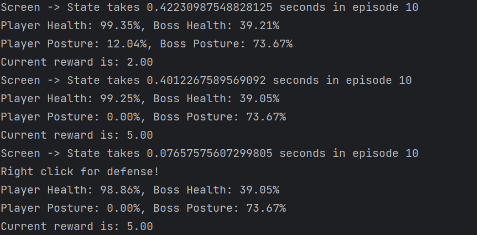
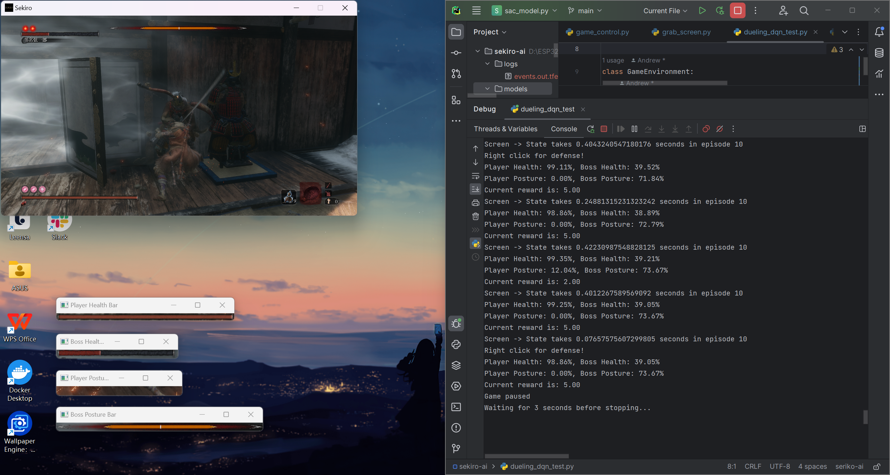

# Project Title
A Fighting/ARPG Game Agent Based on DQN (Dueling-DQN)

# Objective
Develop an agent capable of learning to play a game by observing gameplay and experimenting repeatedly, much like a human player would.

# Motivation
AlphaGo's remarkable performance in Go has demonstrated the power of reinforcement learning in structured environments. However, in more complex, unrestricted settings, can an agent similarly learn through continuous interaction and eventually master the game? This project aims to explore that question.

# Approach
We chose the game Sekiro for this project, as Street Fighter 6 is both prohibitively expensive and heavily regulated regarding modifications.

1. **State Extraction**: Capture in-game character states through screen capturing.
2. **Control**: Enable the agent to control the keyboard and mouse.
3. **Reward System**: Design a reward system based on observed states.
4. **Agent Design**: Develop a Dueling-DQN agent to play the game.
e
# Progress So Far
**Screen Capture**:  

We've successfully implemented screen capture and can assess the character state by counting red/yellow pixels. For the Player health bar, 
we make this judgment based on a benchmark value (the maximum number of red pixel values currently detected). The ratio between the calculated red pixels and 
the benchmark value is used to estimate the current health percentage.  

 

For the boss posture bar, there are two parts:  

**Color Detection**: Detects the specific color of the pose bar (orange), only analyzing the middle area of the image and ignoring the irrelevant edge parts.  

**Edge Detection**: Converts the image to grayscale and applies edge detection (Canny) to further confirm the presence of the pose bar by the number of edges.
  

**Control Implementation**: We're using the `ctypes` package to control keyboard inputs.  

**Reward System**: A preliminary version of the reward system has been designed, with ongoing refinements.  

Rewards are evaluated based on health and posture changes.  

Player health decreases by more than 6%: -6 reward (penalty) is given, and a stop sign is set to prevent duplicate rewards.  

Boss health decreases by more than 3%: +8 reward is given, and a stop sign is set.  

Player posture increases by more than 6%: -3 reward (penalty) is given.  

Boss posture increases by more than 4%: +5 reward is given.  

  

**Agent Design**: A prototype Dueling-DQN agent has been created(not start training), though further modifications are likely needed.

# Next Steps
- Finalize the reward system.
- Refine the Dueling-DQN agent.

# Testing Plan and Expected Outcomes
- **Agent Performance**: Assess if the agent can successfully defeat the boss it was trained against.
- **Generalization Ability**: Evaluate whether the agent displays basic transferable skills when facing different bosses.
- **Cross-Game Capability**: Test if the trained agent performs competently in other similar fighting/ARPG games.

# Challenges Anticipated
1. **Training Uncertainty**: The training process may be unpredictable, time-consuming, and prone to unforeseen errors.
2. **Resource Limitations**: Limited computational resources and budget could hinder progress.
3. **Testing Complexity**: Testing in other games may require considerable debugging (e.g., resetting combo moves), which could be time-consuming and difficult to manage given our constraints.

